## Hi there 👋

---

### 🧠 Languages & Core

---

### ⚛️ Frontend

> React · TypeScript · Next.js 14 (App Router) · Material UI (MUI) · Tailwind CSS · shadcn/ui · Vite · React Router · Framer Motion · React Flow · React Intl (i18n) · Formik · Yup · @hello-pangea/dnd · react-syntax-highlighter · SimpleBar · Notistack · tailwindcss-animate

---

### 🔐 Auth & Security

> JWT · Auth0 · OAuth / SSO · Refresh Token Rotation · Contact Obfuscation (anti-scraping)

---

### 🌐 API & Communication

> REST APIs · Axios · Server-Sent Events (SSE) · Next.js API Routes · Postman

---

### 🗄️ Databases

> PostgreSQL · H2

---

### 📣 Integrations & Marketing

> ActiveCampaign · Vercel · Google Search Console

---

### 🔍 SEO

> Schema.org Structured Data · Dynamic Sitemap · Robots.txt · Open Graph · Semantic HTML

---

### 🧪 Testing

> Selenium

---

### 🛠️ Dev Tools & Environment

---

### 💻 OS & Platforms

---

### 🎨 Design

> Figma · Adobe Illustrator · Adobe Photoshop · AutoCAD
